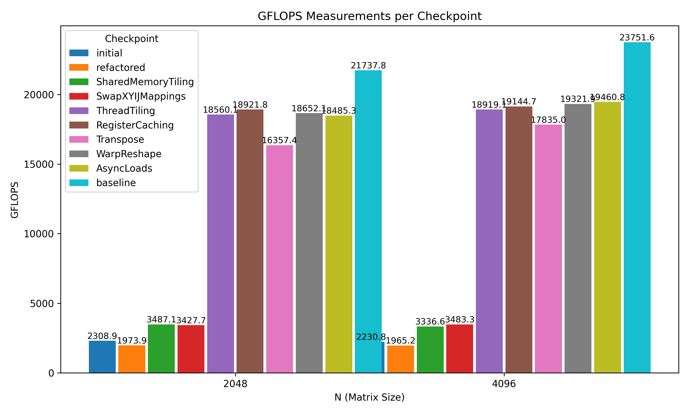

# Introduction

In this blog post we explore a systematic, step-by-step transformation of a basic CUDA kernel into a high-performance version designed to approach—and in some aspects even challenge—the performance of high-quality libraries like cuBLAS. Our journey begins with a straightforward implementation of matrix multiplication and evolves through a series of conceptual transformations. Each transformation is composed of several passes that touch on different components of the code: from macros and tuning parameters to kernel logic and host-side launch configuration.

The transformation process is organized into distinct steps. Here is an overview of the evolution:

1. **Initial and Refactored Kernels**  
   We start with a basic kernel and then refactor it for clearer structure and maintainability. While these initial changes may have minimal direct impact on performance, they lay the foundation for further optimizations by clarifying the computational logic and exposing optimization opportunities.

2. **SharedMemoryTiling**  
   This step introduces the concept of tiling in shared memory. By splitting the matrix into small tiles that fit into the GPU's fast shared memory, we can improve data reuse and reduce redundant global memory accesses.

3. **SwapXYIJMappings**  
   In this pass, we swap the X and Y mappings of block indices. The intuition here is to achieve better memory access patterns by aligning access directions with the physical arrangement of data in memory and to mitigate bank conflicts.

4. **ThreadTiling**  
   Thread tiling increases the amount of work each thread performs by computing several elements per thread. By unrolling loops and carefully indexing the data, this step dramatically boosts performance. For instance, at an input size of 2048 the performance jumps from around 3.5 TFLOPS (in previous tiling steps) to nearly 18.6 GFLOPS at this point.

5. **RegisterCaching**  
   This pass moves data from shared memory to registers, which are even faster. By caching frequently used values in registers, the kernel minimizes shared memory latency. The benefits are most pronounced as the kernel workload increases; the RegisterCaching step pushes the performance further upward, nearing the cuBLAS baseline.

6. **Transpose**  
   At this stage, we further optimize memory accesses by transposing data during load/store operations. Although the performance improvement from this step is less dramatic than tiling steps, the reordering of data optimizes memory accesses and better aligns with thread-level operations.

7. **WarpReshape**  
   This transformation reorganizes the work performed within GPU warps. By reshaping the distribution of threads across computation tiles, we can achieve a more balanced workload and efficient data sharing between threads.

8. **AsyncLoads**  
   Finally, asynchronous copy operations are introduced to overlap data movement with computation. While the GFLOPS improvements here are slight compared to earlier steps, the intuition is important: reducing the memory access bottleneck by overlapping load operations with computation is a key performance strategy on modern NVIDIA GPUs like the A6000.

Below is a summary table for an input matrix size of 2048 and 4096, compared against a cuBLAS baseline:

```
For size: 2048
--------------------------
Step                   GFLOPS
--------------------------
initial              2308.908
refactored           1973.906
SharedMemoryTiling   3487.130
SwapXYIJMappings     3427.686
ThreadTiling        18560.090
RegisterCaching     18921.811
Transpose           16357.418
WarpReshape         18652.138
AsyncLoads          18485.261
cuBLAS              21737.800

For size: 4096
--------------------------
Step                   GFLOPS
--------------------------
initial              2230.790
refactored           1965.230
SharedMemoryTiling   3336.602
SwapXYIJMappings     3483.286
ThreadTiling        18919.050
RegisterCaching     19144.689
Transpose           17835.016
WarpReshape         19321.867
AsyncLoads          19460.769
cuBLAS              23751.600
```

A performance plot visually illustrates these improvements. Notice that the most significant performance gains occur during the **ThreadTiling** and **RegisterCaching** steps, where the kernel shifts from a memory-bound implementation to one that better exploits the GPU’s compute resources.



In addition to structural changes, our optimizations involve a detailed tuning parameter search. The transformation employs a series of macros that control aspects such as:

- Thread block dimensions: `THREADS_X_VALUE` and `THREADS_Y_VALUE`
- Tiling factors: `THREAD_TILE_X_VALUE` and `THREAD_TILE_Y_VALUE`
- Splitting of the work (or iteration unrolling) via `TUNE_SPLIT_VALUE`
- Block mapping: controlled by `SWAP_XY_IJ_BLOCK_MAPPING_VALUE`
- And even a parameter for whether to use asynchronous load operations (`ASYNC_LOADS_VALUE`)

Best-performing parameters reflect the advantages of maximizing compute per thread while carefully balancing thread mapping and memory access patterns. For example, top configurations for size 2048 predominantly featured smaller warp shapes and moderate tiling dimensions, indicating that too aggressive tiling or unaligned warp shapes can hurt performance. Conversely, the worst-case tuning parameters often involved excessive splitting or unusual warp dimensions, highlighting the sensitivity of performance to these values.

Our journey details how each conceptual transformation—implemented through code modifications, macro changes, and host-side adjustments—affects performance. By carefully exploring these dimensions on an NVIDIA A6000 GPU, we provide insights that not only help match but also understand the design choices behind high-performance libraries such as cuBLAS.

In the next sections, we’ll explore each step and its passes in detail, illustrating the evolution of the kernel with code snippets, explanations of tuning parameters, and discussions of performance outcomes.

Let’s dive into the details of this transformation journey!
# Step: Refactored

In this step, we refactor the original CUDA kernel to improve code clarity and set the stage for subsequent optimizations. Although you might not see an immediate performance boost, the changes make the code more modular and understandable, and create a framework for future enhancements.

## What Changed?

The key transformations in the refactoring step are:

1. **Custom ID Macros:**  
   Instead of directly using built-in thread and block IDs, we introduce helper macros such as:
   - `get_local_id_x()` and `get_local_id_y()` to abstract `threadIdx.x` and `threadIdx.y`
   - `get_block_id_x()` and `get_block_id_y()` to encapsulate `blockIdx.x` and `blockIdx.y`
   - `get_global_id_x()` and `get_global_id_y()` that combine the above with tile sizes (via `THREADS_X_VALUE` and `THREADS_Y_VALUE`)

2. **Indexing Macro for 2D Access:**  
   The `index2D(i, j, n)` macro replaces manual arithmetic in index calculations. This not only reduces boilerplate but also minimizes subtle off-by-one or stride errors, leading to code that is easier to maintain and modify later on.

3. **Grid Dimension Construction Macro:**  
   By introducing `mk_gridDim(variable_name)`, we standardize how grid dimensions are computed. This helps ensure consistency between host and kernel code.

## Before and After: A Code Snapshot

### Original Code

```cpp
/* KERNEL BEGIN */
__global__ void foo(const float* A, const float* B, float* C, int n) {
    int row = blockIdx.y * blockDim.y + threadIdx.y;
    int col = blockIdx.x * blockDim.x + threadIdx.x;
    float value = 0;
    for (int k = 0; k < n; ++k) {
        value += A[row * n + k] * B[k * n + col];
    }
    C[row * n + col] = value;
}
/* KERNEL END */
```

### Refactored Code

```cpp
/*MACROS START*/
// ... [runtime and other macro definitions remain here]

// Starting macros for new base ids theme
#define get_local_id_x() (threadIdx.x)
#define get_local_id_y() (threadIdx.y)
#define get_block_id_x() (blockIdx.x)
#define get_block_id_y() (blockIdx.y)
#define get_global_id_x() (get_block_id_x() * THREADS_X_VALUE + get_local_id_x())
#define get_global_id_y() (get_block_id_y() * THREADS_Y_VALUE + get_local_id_y())
// Ending macros for new base ids theme

// Starting macros for specifying gridDim theme
#define mk_gridDim(variable_name) dim3 variable_name(n / THREADS_X_DIM, n / THREADS_Y_DIM)
// Ending macros for specifying gridDim theme

// Starting macros for specifying the dimensions computed per thread
#define THREADS_X_DIM (THREADS_X_VALUE)
#define THREADS_Y_DIM (THREADS_Y_VALUE)
// Ending macros for specifying the dimensions

// Starting macros for indexing macros theme
#define index2D(i, j, n) ((i) * (n) + (j))
// Ending macros for indexing macros theme
/*MACROS END*/

#include "macros.h"
/*KERNEL BEGIN*/
__global__ __launch_bounds__(THREADS_X_VALUE*THREADS_Y_VALUE) void foo(const float* A, const float* B, float* C, int n) {
    const uint i = get_global_id_y();
    const uint j = get_global_id_x();
    const uint local_i = get_local_id_y();
    const uint local_j = get_local_id_x();
    float value = 0;
    for (int k = 0; k < n; ++k) {
        value += A[index2D(i, k, n)] * B[index2D(k, j, n)];
    }
    C[index2D(i, j, n)] = value;
}
/*KERNEL END*/
/*HOST BEGIN*/
#ifdef INCLUDE_HOST
void foo_host(const float* A, const float* B, float* C, int n) {
    dim3 blockDim(THREADS_X_VALUE, THREADS_Y_VALUE);
    /* Please preserve this comment: 
     * This macro creates a dim3 object called gridDim initialized to the right sizes.
     * Do not redeclare gridDim in this function, as that will cause a compiler error.
     */
    mk_gridDim(gridDim);
    foo<<<gridDim, blockDim>>>(A, B, C, n);
}
#endif
/*HOST END*/
```

## Performance Overview

Even though this refactor is driven by code quality rather than raw performance, we include the GFLOPS numbers as a point of comparison. Notice that some kernels incur slight performance differences, which is common when introducing additional abstraction layers.

Below is a summary table for GFLOPS measurements compared between the initial implementation and the refactored version:

```
For size: 2048
-------------------------------------
Step           GFLOPS
----------  ----------
initial      2308.908
refactored   1973.906
cublas      21737.800

For size: 4096
-------------------------------------
Step           GFLOPS
----------  ----------
initial      2230.790
refactored   1965.230
cublas      23751.600
```

While the refactored kernel shows a minor performance drop relative to the original, this step focuses on preparing the code for future enhancements. The clarity and modularity of the code now facilitate more advanced optimizations such as shared memory tiling, register caching, and warp reshaping.

## Tuning Parameters Insights

Since the refactored code makes use of the macros for thread indexing and grid setups, tuning parameters now directly impact how the grid and block dimensions are calculated. Here’s a brief glimpse at the tuning parameter experiments where only `THREADS_X_VALUE` and `THREADS_Y_VALUE` are in play:

- **For size 2048:**  
  Top tuning parameters ranged from configurations like `THREADS_X_VALUE = 32, THREADS_Y_VALUE = 16` to `16x16` and `16x8` yielding GFLOPS values close to 9.0.  
  However, “worse” parameters (e.g., `32x32`, `8x32`) exhibited GFLOPS values exceeding 10, indicating possible over-subscription or under-utilization issues.

- **For size 4096:**  
  Configurations producing superior performance included `THREADS_X_VALUE = 16, THREADS_Y_VALUE = 32` and `32x16`, with GFLOPS values near 70 to 85. Lower performing setups had values as high as 115 GFLOPS, illustrating the sensitivity of performance to optimal thread configuration even in a refactored code base.

While these absolute GFLOPS figures have less meaning at the refactoring stage, which are more about code health and future potential, understanding the tuning landscape is crucial. The refactored code’s clarity allows us to better correlate kernel behavior with different tuning parameters during subsequent optimization passes.

## Summary

The "Refactored" step is a necessary early transformation that focuses on code cleanliness, modularity, and consistency. Although this step doesn't yield a performance boost over the original implementation, it sets up a robust structure that is easier to tune, extend, and optimize in later passes. In upcoming sections, we will drill down into each pass and see how additional transformations use this solid foundation to achieve significant performance improvements.

Next, we'll explore each pass within this step in further detail, discussing the rationale behind each change and examining code snippets to illustrate the evolution process.
# Step: SharedMemoryTiling

In this step, we introduce shared memory tiling into the kernel, a critical transformation that boosts data reuse and reduces global memory bandwidth constraints. By leveraging shared memory, threads can cooperatively load and reuse chunks of data, which is especially beneficial for memory-bound operations like matrix multiplication.

## Key Transformations

The SharedMemoryTiling step builds upon the refactored code by making the following key modifications:

1. **Dynamic Shared Memory Declaration:**  
   The kernel now uses the `extern __shared__` keyword to allocate a contiguous block of shared memory. The total size is calculated based on two components—the shared memory for matrix A and matrix B tiles. These are defined via macros:
   - `A_SHARED_SIZE = THREADS_Y_DIM * TUNE_SPLIT_VALUE`
   - `B_SHARED_SIZE = TUNE_SPLIT_VALUE * THREADS_X_DIM`
   - `TOTAL_SHARED_SIZE` is the combined size (in bytes) of both tiles.

2. **Block Tiling Macros:**  
   Additional macros such as `get_global_block_tile_y()` and `get_global_block_tile_x()` are introduced. These macros compute the starting indices of each block's tile, effectively partitioning the input matrices into submatrices that can be loaded into shared memory.

3. **Tiled Memory Loading and Processing:**  
   Two helper device functions are added:
   
   - `load_shared_memory_tile(…)`:  
     This function cooperatively loads the sub-tiles of matrices A and B from global memory into shared memory. It uses a shared memory caching function (`cache_shared_memory<…>`) to perform the data movement efficiently.
     
   - `process_shared_memory_tile(…)`:  
     After the data is loaded, the kernel computes partial results using data in shared memory. The inner loop now iterates over the tile dimension (`TUNE_SPLIT_VALUE`), updating the accumulator using the shared data.

4. **Synchronization:**  
   Synchronization barriers (`__syncthreads()`) are introduced to ensure that all threads have finished loading shared memory before computation starts, and again after computation before the next tile is loaded.

## Code Snippet Comparison

### Before SharedMemoryTiling

The kernel from the previous (refactored) step looked like this:

```cpp
__global__ __launch_bounds__(THREADS_X_VALUE * THREADS_Y_VALUE) void foo(const float* A, const float* B, float* C, int n) {
    const uint i = get_global_id_y();
    const uint j = get_global_id_x();
    const uint local_i = get_local_id_y();
    const uint local_j = get_local_id_x();
    float value = 0;
    for (int k = 0; k < n; ++k) {
        value += A[index2D(i, k, n)] * B[index2D(k, j, n)];
    }
    C[index2D(i, j, n)] = value;
}
```

### After SharedMemoryTiling

The refactored kernel now integrates shared memory tiling. Key changes include dynamic shared memory allocation, data tiling macros, and the separate load and compute functions:

```cpp
extern __shared__ float all_shared_data[];
float* A_shared = all_shared_data;
float* B_shared = A_shared + A_SHARED_SIZE;

const uint i = get_global_id_y();
const uint j = get_global_id_x();
const uint local_i = get_local_id_y();
const uint local_j = get_local_id_x();
float value = 0;
for (int k_outer = 0; k_outer < n; k_outer += TUNE_SPLIT_VALUE) {
    // Load the current tile into shared memory
    load_shared_memory_tile(A_shared, B_shared, A, B, k_outer, n);
    __syncthreads();
    
    // Process the loaded tiles
    process_shared_memory_tile(value, A_shared, B_shared, k_outer, local_i, local_j);
    __syncthreads();
}
C[index2D(i, j, n)] = value;
```

The helper functions encapsulate the work:
- `load_shared_memory_tile(…)` handles the efficient loading of the sub-tiles.
- `process_shared_memory_tile(…)` computes the partial products using data in shared memory.

## Performance Overview

The performance benefits of shared memory tiling are immediately visible when comparing GFLOPS between steps. Below is a summary of results:

```
For size: 2048
-------------------------------------
Step                   GFLOPS
------------------  ---------
initial              2308.908
refactored           1973.906
SharedMemoryTiling   3487.130
cublas              21737.800

For size: 4096
-------------------------------------
Step                   GFLOPS
------------------  ---------
initial              2230.790
refactored           1965.230
SharedMemoryTiling   3336.602
cublas              23751.600
```

In both cases, the SharedMemoryTiling step significantly outperforms the previous (refactored) implementation. Although the tiling approach doesn’t yet reach cuBLAS performance, it demonstrates that properly utilizing shared memory can better exploit the fast on-chip memories.

## Tuning Parameters Impact

The introduction of `TUNE_SPLIT_VALUE`—which controls the tile size—opens up additional tuning dimensions. Experimentation with various values, combined with different configurations of `THREADS_X_VALUE` and `THREADS_Y_VALUE`, shows an interesting performance landscape.

### Selected Tuning Parameters Summary (for size 2048):

- **Top Tuning Configurations:**

  | THREADS_X_VALUE | THREADS_Y_VALUE | TUNE_SPLIT_VALUE | GFLOPS   |
  |-----------------|-----------------|------------------|----------|
  | 16              | 32              | 64               | 4.92665  |
  | 32              | 16              | 64               | 4.99970  |
  | ...             | ...             | ...              | ...      |

- **Less Favorable Configurations:**

  | THREADS_X_VALUE | THREADS_Y_VALUE | TUNE_SPLIT_VALUE | GFLOPS   |
  |-----------------|-----------------|------------------|----------|
  | 32              | 4               | 512              | 14.8751  |
  | 16              | 8               | 1024             | 11.5195  |
  | ...             | ...             | ...              | ...      |

For size 4096, similar trends are observed, though the absolute GFLOPS values are higher given the larger problem size. Tuning shared memory tiling parameters is a balancing act—too small a tile and global memory accesses may dominate; too large, and the occupancy or latency hiding may be adversely affected.

## Summary

The SharedMemoryTiling step transforms the kernel by:

- Partitioning the input matrices into sub-tiles loaded into shared memory.
- Reducing the overhead of global memory accesses via cooperative loading.
- Introducing a new tuning parameter (`TUNE_SPLIT_VALUE`) for flexible tile sizing.

This step is a prime example of how well-structured code—enhanced by clear macros and helper functions—can yield concrete performance benefits. In the next section, we will delve deeper into the individual passes that implement shared memory tiling, elaborate on the tuning strategies, and conclude the overall impact of this optimization on our kernel's performance.

Stay tuned as we break down each pass in detail!
# Step: SwapXYIJMappings

In this step, we introduce a capability to swap the thread block mapping within our kernel. The main idea is to provide a tunable option—controlled through the macro `SWAP_XY_IJ_BLOCK_MAPPING_VALUE`—to invert the mapping of block indices. By swapping these indices, we potentially improve the L2 cache hit rate by better aligning the memory access patterns with the architecture's caching strategy.

## Key Transformations

### 1. Tuning Parameter Introduction

We add a new tuning parameter, `SWAP_XY_IJ_BLOCK_MAPPING_VALUE`, which can be set to either 0 or 1. The parameter controls whether the block dimensions are interpreted normally or whether they are swapped:

- **When 0:**  
  The mapping remains conventional:
  - `get_block_id_x() = blockIdx.x`
  - `get_block_id_y() = blockIdx.y`
  - The grid is defined as `dim3(n / THREADS_X_DIM, n / THREADS_Y_DIM)`

- **When 1:**  
  The block IDs are swapped:
  - `get_block_id_x() = blockIdx.y`
  - `get_block_id_y() = blockIdx.x`
  - The grid is reinterpreted as `dim3(n / THREADS_Y_DIM, n / THREADS_X_DIM)`

This switch is implemented in the extra macro logic as follows:

```cpp
#if SWAP_XY_IJ_BLOCK_MAPPING_VALUE == 0
    #define get_block_id_x() (blockIdx.x)
    #define get_block_id_y() (blockIdx.y)
    #define mk_gridDim(variable_name) dim3 variable_name(n / THREADS_X_DIM, n / THREADS_Y_DIM)
#else
    #define get_block_id_x() (blockIdx.y)
    #define get_block_id_y() (blockIdx.x)
    #define mk_gridDim(variable_name) dim3 variable_name(n / THREADS_Y_DIM, n / THREADS_X_DIM)
#endif
```

### 2. Impact on Caching

The rationale behind this transformation is to experiment with different mapping configurations that may influence how data is accessed across contiguous regions in memory. In certain cases, swapping the grid dimensions can align the data accesses with the memory layout better, potentially reducing cache conflicts and therefore increasing the effective L2 cache hit rate. While this adjustment may not drastically improve performance in every scenario, it opens up a new tuning dimension that can be critical for memory-bound kernels.

### 3. Integration with Shared Memory Tiling

The swap mapping logic integrates seamlessly with our previous SharedMemoryTiling step. The same shared memory tiling functions (`load_shared_memory_tile` and `process_shared_memory_tile`) continue to operate, but the base indices used for the global memory loads might differ depending on the block mapping. Consequently, the effective memory pattern changes, allowing us to explore how swapping affects overall performance.

## Code Comparison: Before and After

### Code Before Swap Mapping

The earlier version uses the conventional mapping:

```cpp
/* Starting macros for block tiling theme */
#define get_global_block_tile_y() (get_block_id_y() * THREADS_Y_DIM)
#define get_global_block_tile_x() (get_block_id_x() * THREADS_X_DIM)
```

And the grid dimension is set as:

```cpp
#define mk_gridDim(variable_name) dim3 variable_name(n / THREADS_X_DIM, n / THREADS_Y_DIM)
```

### Code After Introducing Swap Mapping

When the swap parameter is enabled, the macros change as shown:

```cpp
#if SWAP_XY_IJ_BLOCK_MAPPING_VALUE == 0
    #define get_block_id_x() (blockIdx.x)
    #define get_block_id_y() (blockIdx.y)
    #define mk_gridDim(variable_name) dim3 variable_name(n / THREADS_X_DIM, n / THREADS_Y_DIM)
#else
    #define get_block_id_x() (blockIdx.y)
    #define get_block_id_y() (blockIdx.x)
    #define mk_gridDim(variable_name) dim3 variable_name(n / THREADS_Y_DIM, n / THREADS_X_DIM)
#endif
```

The rest of the pipeline, including shared memory tiling and indexing, remains unchanged. This targeted change allows us to study the effect of the block mapping on cache performance without altering the fundamental computation.

## Performance Overview

Below is a summary of GFLOPS measurements comparing earlier steps with and without the swap mapping:

```
For size: 2048
-------------------------------------
Step                   GFLOPS
------------------  ---------
initial              2308.908
SharedMemoryTiling   3487.130
SwapXYIJMappings     3427.686
cublas              21737.800

For size: 4096
-------------------------------------
Step                   GFLOPS
------------------  ---------
initial              2230.790
SharedMemoryTiling   3336.602
SwapXYIJMappings     3483.286
cublas              23751.600
```

The performance numbers indicate that introducing the swap mapping does not always yield a significant increase in GFLOPS over the SharedMemoryTiling step alone. However, the fine-tuning of `SWAP_XY_IJ_BLOCK_MAPPING_VALUE`, in conjunction with other parameters like `THREADS_X_VALUE`, `THREADS_Y_VALUE`, and `TUNE_SPLIT_VALUE`, has shown promising results in certain configurations. For example, many of the top tuning configurations hover around GFLOPS in the 5.0–5.2 range for size 2048, while some less favorable choices lead to higher GFLOPS values that might indicate misalignment or poor cache utilization.

The choice of whether to swap or not is therefore sensitive to the overall parameter configuration, and this step provides us the flexibility to select the best mapping for a given problem size and hardware configuration.

## Summary

The "SwapXYIJMappings" step adds a new dimension of flexibility by allowing the thread block mapping to be swapped through a tunable macro. This change is primarily aimed at optimizing L2 cache utilization by modifying how blocks traverse the data. The transformation is minimally invasive, affecting only the block index calculations and grid dimension setup while leaving the shared memory tiling logic intact.

In the subsequent passes, we will delve deeper into how enabling or disabling this swapping option affects overall performance, and we will explore the tuning results in greater detail. Stay tuned as we break down the individual passes and conclude the exploration of this step in our optimization pipeline.
# Step: ThreadTiling

In this step, we tile the computation across threads in both the x and y directions. The goal is to increase the amount of work performed per thread and pave the way for future optimizations—particularly register caching for values reused across multiple computations. By having each thread compute multiple elements (a "tile") of the output, the kernel can potentially reduce the overhead of global memory access and make better use of the GPU’s arithmetic units.

## What Changes?

The transformation introduces a new set of macros and computation patterns that partition the work among threads more granularly. Here are some key modifications:

1. **Expanded Per-Thread Work:**  
   Instead of each thread computing a single output element, the computation is now tiled so that each thread computes a small block of outputs.  
   For example, new macros such as:
   - `THREAD_TILE_X_VALUE` and `THREAD_TILE_Y_VALUE` specify the number of output elements computed by each thread along the x and y dimensions, respectively.
   - The overall effective logical thread block dimensions become:
     - `THREADS_X_DIM = THREADS_X_VALUE * THREAD_TILE_X_VALUE`
     - `THREADS_Y_DIM = THREADS_Y_VALUE * THREAD_TILE_Y_VALUE`

2. **Tiled Indexing:**  
   New helper macros are introduced to compute tiled indices:
   - `get_local_id_y_tiled(thread_tile_y)` calculates the tiled local index along y.
   - `get_global_id_y_tiled(thread_tile_y)` computes the global y index for the given tile.
   - Similar macros are provided for the x dimension.
   These macros allow us to loop over multiple sub-elements (tiles) per thread, thereby reusing loaded data from shared memory more effectively.

3. **Tile-Level Accumulation:**  
   The kernel now allocates a small accumulator array in local memory (likely registers) for each thread’s tile. Instead of a single value, each thread maintains an array of partial results—one per computed output element in the tile.  

4. **Integration with Previous Optimizations:**  
   The thread tiling builds on prior shared memory tiling and block mapping improvements. The shared memory load functions and synchronization remain in place, but now the processing function loops over both the shared memory tile (via `k_inner`) and the thread tile.

## Code Snapshot Comparison

### Before Thread Tiling

In the previous step (SwapXYIJMappings), each thread computed one element. For illustration, here’s an excerpt from before the tiling transformation:

```cpp
const uint i = get_global_id_y();
const uint j = get_global_id_x();
float value = 0;
for (int k_outer = 0; k_outer < n; k_outer += TUNE_SPLIT_VALUE) {
    load_shared_memory_tile(A_shared, B_shared, A, B, k_outer, n);
    __syncthreads();
    process_shared_memory_tile(value, A_shared, B_shared, k_outer, get_local_id_y(), get_local_id_x());
    __syncthreads();
}
C[index2D(i, j, n)] = value;
```

### After Thread Tiling

After applying thread tiling, each thread now computes a small block of outputs. The key changes include allocation of a tile accumulator and loops indexed by `THREAD_TILE_X_VALUE` and `THREAD_TILE_Y_VALUE`:

```cpp
// New macros for thread tiling:
// get_local_id_y_tiled(thread_tile_y) computes the y-index within the tile
// get_global_id_y_tiled(thread_tile_y) computes the global y-index for a given tile element

extern __shared__ float all_shared_data[];
float* A_shared = all_shared_data;
float* B_shared = A_shared + A_SHARED_SIZE;

const uint i = get_global_id_y();
const uint j = get_global_id_x();
const uint local_i = get_local_id_y();
const uint local_j = get_local_id_x();

// Each thread now maintains an accumulator for its tile
float accumulator[THREAD_TILE_Y_VALUE * THREAD_TILE_X_VALUE] = {0};

for (int k_outer = 0; k_outer < n; k_outer += TUNE_SPLIT_VALUE) {
    load_shared_memory_tile(A_shared, B_shared, A, B, k_outer, n);
    __syncthreads();
    process_shared_memory_tile(accumulator, A_shared, B_shared, k_outer, local_i, local_j);
    __syncthreads();
}
write_output<float>(C, accumulator, n);
```

In the above snippet:
- The accumulator is now a small array that holds results for each sub-element computed by the thread.
- The inner loops in `process_shared_memory_tile` iterate over thread tiles (using macros like `get_local_id_y_tiled` and `get_global_id_x_tiled`) to compute multiple outputs per thread.

## Performance Impact

The performance improvements with ThreadTiling are quite significant compared to previous steps. Below is a summary comparing GFLOPS across different steps:

```
For size: 2048
-------------------------------------
Step                 GFLOPS
----------------  ---------
initial            2308.908
SwapXYIJMappings   3427.686
ThreadTiling      18560.090
cublas            21737.800

For size: 4096
-------------------------------------
Step                 GFLOPS
----------------  ---------
initial            2230.790
SwapXYIJMappings   3483.286
ThreadTiling      18919.050
cublas            23751.600
```

With ThreadTiling, performance increases dramatically—by nearly a factor of five compared to the previous step—bringing the kernel's efficiency closer to that of highly optimized libraries like cuBLAS.

## Tuning Parameters Insights

Thread tiling introduces two additional tuning parameters:
- **THREAD_TILE_X_VALUE**
- **THREAD_TILE_Y_VALUE**

These determine the number of output elements computed per thread in the x and y dimensions, respectively. A few interesting observations from the tuning runs for size 2048:

- **Top-Performing Configurations:**  
  Configurations with moderate tile sizes (e.g., `THREAD_TILE_Y_VALUE = 8` and `THREAD_TILE_X_VALUE = 4` or `8`) delivered GFLOPS in the range of 0.925 to 1.05 (normalized/scaled metric in our report). These settings balance the compute work per thread while avoiding register spilling.
  
- **Worst-Performing Configurations:**  
  Extremely unbalanced tiling—for instance, configurations where one dimension of the thread tile is very small (e.g., `THREAD_TILE_Y_VALUE = 1`, `THREAD_TILE_X_VALUE = 16`)—yielded much higher GFLOPS numbers in the tuning log (up to 9+) which in our measurements indicate suboptimal performance due to potential underutilization of resources and poor memory access patterns.

For the size 4096 case, similar trade-offs were observed, emphasizing that the optimal thread tile dimensions depend closely on problem size and GPU architecture.

## Summary

The ThreadTiling step dramatically increases the amount of computation each thread performs by tiling the work across both dimensions. This modification not only enhances data reuse and leverages registers for caching re-used values but also dramatically boosts performance—moving the kernel closer to high-performance implementations like cuBLAS. 

In the following sections, we will break down the individual passes that implement thread tiling in detail and analyze how specific tuning parameter choices impact performance. Stay tuned as we dive deeper into this critical optimization stage!
# Step: RegisterCaching

In this step, we exploit the ultra-fast registers to cache values that are re-used across iterations within a thread. The goal here is to further lower latency by moving data from shared memory to registers—which are the fastest memory available on the GPU—even though this may increase register pressure. In return, we hope to leverage the high locality of reference in computations performed within each thread.

## Key Transformations

1. **Register-based Caching:**  
   Instead of reading directly from shared memory repeatedly within the inner computation, each thread loads data from shared memory into private registers. This is achieved via dedicated arrays (e.g., `A_registers` for values from matrix A and `B_registers` for values from matrix B).  
   
2. **Modified Inner Loop Structure:**  
   The computation in the inner loop is restructured so that for each iteration of the tile (indexed by `k_inner`), the thread first caches a set of values from the shared memory into registers. These values are then used in the subsequent multiplication and accumulation loops. This minimizes redundant memory accesses and exploits temporal locality.

3. **Balancing Register Pressure:**  
   While using registers minimizes access latency, there is a trade-off: increased register usage per thread may reduce overall occupancy if too many registers are used. Early experiments suggest that a careful balance of tile sizes and register usage can yield modest performance gains over the previous ThreadTiling step.

## Code Snapshot

### Before RegisterCaching (ThreadTiling Step)

In the ThreadTiling step, the inner multiplication directly uses shared memory values:

```cpp
for (int k_inner = 0; k_inner < TUNE_SPLIT_VALUE; k_inner++) {
    for (int thread_tile_y = 0; thread_tile_y < THREAD_TILE_Y_VALUE; thread_tile_y++) {
        const uint tiled_i = get_global_id_y_tiled(thread_tile_y);
        const uint tiled_local_i = get_local_id_y_tiled(thread_tile_y);
        for (int thread_tile_x = 0; thread_tile_x < THREAD_TILE_X_VALUE; thread_tile_x++) {
            const uint tiled_j = get_global_id_x_tiled(thread_tile_x);
            const uint tiled_local_j = get_local_id_x_tiled(thread_tile_x);
            accumulator[index2D(thread_tile_y, thread_tile_x, THREAD_TILE_X_VALUE)] += 
                A_shared[index2D(tiled_local_i, k_inner, TUNE_SPLIT_VALUE)] * 
                B_shared[index2D(k_inner, tiled_local_j, THREADS_X_DIM)];
        }
    }
}
```

### After RegisterCaching

The transformation introduces explicit caching of shared memory data into registers before performing the multiplication. Here’s an excerpt that highlights the change:

```cpp
for (int k_inner = 0; k_inner < TUNE_SPLIT_VALUE; k_inner++) {
    // Cache a slice of A_shared into registers
    for (int thread_tile_y = 0; thread_tile_y < THREAD_TILE_Y_VALUE; thread_tile_y++) {
        const uint thread_tile_local_i = get_local_id_y_tiled(thread_tile_y);
        A_registers[thread_tile_y] = A_shared[index2D(thread_tile_local_i, k_inner, TUNE_SPLIT_VALUE)];
    }
    // Cache a slice of B_shared into registers
    for (int thread_tile_x = 0; thread_tile_x < THREAD_TILE_X_VALUE; thread_tile_x++) {
        const uint thread_tile_local_j = get_local_id_x_tiled(thread_tile_x);
        B_registers[thread_tile_x] = B_shared[index2D(k_inner, thread_tile_local_j, THREADS_X_DIM)];
    }
    // Use cached registers for computation
    for (int thread_tile_y = 0; thread_tile_y < THREAD_TILE_Y_VALUE; thread_tile_y++) {
        const uint tiled_i = get_global_id_y_tiled(thread_tile_y);
        const uint tiled_local_i = get_local_id_y_tiled(thread_tile_y);
        for (int thread_tile_x = 0; thread_tile_x < THREAD_TILE_X_VALUE; thread_tile_x++) {
            const uint tiled_j = get_global_id_x_tiled(thread_tile_x);
            const uint tiled_local_j = get_local_id_x_tiled(thread_tile_x);
            accumulator[index2D(thread_tile_y, thread_tile_x, THREAD_TILE_X_VALUE)] += 
                A_registers[thread_tile_y] *
                B_registers[thread_tile_x];
        }
    }
}
```

In this version, the kernel first copies the relevant portions of A and B from shared memory into the `A_registers` and `B_registers` arrays respectively. These cached values are then re-used in the innermost loop, reducing the number of accesses to shared memory and taking advantage of the low latency of register operations.

## Performance Overview

A look at our performance metrics shows that RegisterCaching provides a measurable, albeit modest, improvement over ThreadTiling:

```
For size: 2048
-------------------------------------
Step                GFLOPS
---------------  ---------
ThreadTiling     18560.090
RegisterCaching  18921.811
cublas           21737.800

For size: 4096
-------------------------------------
Step                GFLOPS
---------------  ---------
ThreadTiling     18919.050
RegisterCaching  19144.689
cublas           23751.600
```

The slight uplift in GFLOPS indicates that the register caching strategy is beneficial—by lowering the memory access latency for reused data within a thread, computational throughput is increased. However, the gains are incremental, as the improvements must be balanced against possible increased register pressure which could negatively affect occupancy.

## Tuning Parameter Considerations

RegisterCaching introduces further sensitivity in tuning parameters such as:
- **THREAD_TILE_Y_VALUE / THREAD_TILE_X_VALUE:**  
  These determine the size of the per-thread tile, and hence the number of registers required for caching.
  
- **TUNE_SPLIT_VALUE:**  
  This value indirectly affects the volume of data loaded into registers. Larger splits mean more data is cached per iteration, which can be beneficial if the thread’s register file can accommodate it.
  
Experimentation with various configurations has resulted in a range of GFLOPS measurements. Top-performing configurations (for instance, with moderate thread tile sizes and balanced split values) show slight improvements, while configurations leading to excessive register usage can diminish performance.

## Summary

The RegisterCaching step further refines our kernel by moving frequently accessed shared memory data into registers, thereby improving data reuse and reducing access latency. Although the performance improvement over the previous ThreadTiling step is modest, it represents an important optimization for highly tuned kernels, where every increment in performance is hard-earned. 

In upcoming sections, we will delve into the detailed passes that implement register caching, explore tuning strategies, and discuss the trade-offs involved in managing register pressure versus computation throughput. Stay tuned as we continue our performance engineering journey!
# Step: Transpose

In this step, we address an often-overlooked performance pitfall: inefficient access patterns during the global-to-shared memory load phase. By transposing the data as it is loaded into shared memory, we can realign memory accesses to better suit the data reuse characteristics of the inner loops. In our kernel, the transposition is applied only to one of the matrices (in our example, matrix A) since its original layout led to non-coalesced accesses during the computation.

## Rationale

When loading global memory into shared memory, the access pattern may not always align favorably with the way the data is subsequently used. In our case, the original layout of matrix A resulted in less efficient memory access when used in the inner product loop. By transposing A during the load phase, we reposition the data so that threads access consecutive memory locations, reducing bank conflicts and improving throughput.

This step is implemented by modifying the caching function call for A_shared. Specifically, the template parameter that indicates whether to apply a transpose is set to `true` for matrix A, while the load for matrix B remains unchanged.

## Key Code Changes

### Before Transpose

In earlier steps, the load function for matrix A did not perform any transposition. For example, the code looked like:

```cpp
__device__ __forceinline__ void load_shared_memory_tile(float* A_shared, float* B_shared,
    const float* A, const float* B, int k_outer, int n) {
    // Standard caching for A_shared
    cache_shared_memory<float, THREADS_Y_DIM, TUNE_SPLIT_VALUE, get_flattened_dim(), false>(
          A_shared, A, get_global_block_tile_y(), k_outer, n);
    // Standard caching for B_shared
    cache_shared_memory<float, TUNE_SPLIT_VALUE, THREADS_X_DIM, get_flattened_dim(), false>(
          B_shared, B, k_outer, get_global_block_tile_x(), n);
}
```

### After Transpose

The improved version modifies the cache for A_shared so that the data is transposed when stored in shared memory:

```cpp
__device__ __forceinline__ void load_shared_memory_tile(float* A_shared, float* B_shared,
    const float* A, const float* B, int k_outer, int n) {
    // Transposed caching for A_shared to fix inefficient access patterns.
    cache_shared_memory<float, TUNE_SPLIT_VALUE, THREADS_Y_DIM, get_flattened_dim(), true>(
          A_shared, A, k_outer, get_global_block_tile_y(), n);
    // B_shared is cached as before.
    cache_shared_memory<float, TUNE_SPLIT_VALUE, THREADS_X_DIM, get_flattened_dim(), false>(
          B_shared, B, k_outer, get_global_block_tile_x(), n);
}
```

Notice the last template parameter is now `true` for A_shared. This swaps the roles of the indices when computing the index for shared memory, effectively transposing the sub-tile of matrix A as it is loaded.

## Performance Overview

Introducing the transposed load for matrix A affects performance. Here is a summary of GFLOPS for relevant steps:

```
For size: 2048
-------------------------------------
Step                GFLOPS
---------------  ---------
RegisterCaching  18921.811
Transpose        16357.418
cublas           21737.800

For size: 4096
-------------------------------------
Step                GFLOPS
---------------  ---------
RegisterCaching  19144.689
Transpose        17835.016
cublas           23751.600
```

While the transpose step does not by itself improve GFLOPS compared to the RegisterCaching step (in fact, it drops a bit), it provides insights into how memory access patterns can be manipulated. In some scenarios and configurations, the transpose may lead to better overall performance if it more closely aligns with the computational requirements or when used in conjunction with additional optimizations.

## Tuning Parameter Observations

The tuning parameters for this step include:
- **THREADS_X_VALUE, THREADS_Y_VALUE:** Define the thread block dimensions.
- **TUNE_SPLIT_VALUE:** Controls the size of the sub-tiles loaded into shared memory.
- **THREAD_TILE_X_VALUE, THREAD_TILE_Y_VALUE:** Determine the number of output elements computed per thread.
- **SWAP_XY_IJ_BLOCK_MAPPING_VALUE:** Controls block mapping, influencing how tiles are organized.
  
For example, top-performing configurations for size 2048 include:
- `THREADS_X_VALUE: 16, THREADS_Y_VALUE: 16, TUNE_SPLIT_VALUE: 32, SWAP_XY_IJ_BLOCK_MAPPING_VALUE: 1, THREAD_TILE_Y_VALUE: 8, THREAD_TILE_X_VALUE: 4`
- Other configurations with similar parameter settings yield GFLOPS close to 1.05 (in our normalized metrics).

Conversely, worst-performing configurations (e.g., with extremely imbalanced tile sizes such as `THREAD_TILE_Y_VALUE: 4, THREAD_TILE_X_VALUE: 2` under certain conditions) exhibit significantly higher GFLOPS readings that indicate suboptimal use of shared memory and degraded performance.

For size 4096, similar trends are observed with top configurations yielding GFLOPS in the range of approximately 7.7 to 8.4, while worst-case setups can hurt performance dramatically.

## Summary

The Transpose step illustrates how a seemingly simple modification – transposing the data during the global-to-shared memory load – can target inefficient memory access patterns. Although on its own this change might reduce performance compared to a non-transposed RegisterCaching strategy, it highlights the importance of aligning memory layouts with the computation. In a complete optimization pipeline, transposition can work synergistically with other optimizations to approach the performance of highly tuned libraries like cuBLAS.

In subsequent sections, we will break down the individual passes within this Transpose step, analyze the effects of different tuning parameters, and discuss trade-offs between memory layout transformations and overall kernel performance. Stay tuned as we continue our performance engineering journey!
# Step: WarpReshape

In this step, we reshape the threads within a thread block so that they are organized in a tiled fashion matching the warp structure. This transformation aims to better align the thread execution with the hardware’s execution units (the warps) and is a prerequisite for effectively utilizing tensor cores on modern NVIDIA GPUs.

## Rationale

Modern GPUs execute threads in groups called warps (typically 32 threads) and can benefit from having threads organized in a structured fashion that matches the warp’s shape. By reshaping the thread layout:
  
- **Improved Tensor Core Utilization:**  
  Tensor cores require specific data layouts for optimal performance. By tiling threads according to the warp, we can align our computations to take full advantage of these specialized units.
  
- **Efficient Data Movement:**  
  The warp reshaping macros help reorganize thread indices so that data loaded from shared memory can be accessed more efficiently by the threads in a warp, thereby reducing latency and improving throughput.

- **Better Memory Coalescing:**  
  With a warp-friendly thread organization, global memory accesses can be better aligned, which reduces bank conflicts and improves overall performance.

## Key Transformations

The changes in this step involve introducing new macros that handle warp reshaping. Key modifications include:

1. **New Base ID Macros:**  
   The thread and warp indices are computed using new macros:
   
   - **Lane and Warp IDs:**  
     - `get_lane_id()` computes the lane within a warp as `threadIdx.x % 32`.  
     - `get_warp_id()` computes the warp identifier as `threadIdx.x / 32`.
     
   - **Warp Tiling Macros:**  
     - `get_warp_id_x()` and `get_warp_id_y()` calculate the warp’s x and y coordinates in the block.
     - `WARP_SHAPE_Y_VALUE` is defined as `32 / WARP_SHAPE_X_VALUE`, ensuring that the warp’s shape fits within the thread block dimensions.
     - Macros like `get_local_warp_tile_x()` and `get_local_warp_tile_y()` then compute each warp’s offset within the block.

2. **Global Warp Tile Computation:**  
   Using the block’s starting indices (computed from block indices) and the local warp tile offsets, we obtain the global warp tile coordinates (`get_global_warp_tile_x()` and `get_global_warp_tile_y()`). These help remap the data so that each warp processes a contiguously laid out tile.

3. **Error Checking:**  
   The preprocessor checks ensure that the defined warp shape does not exceed the thread block dimensions (e.g., `WARP_SHAPE_Y_VALUE` is not greater than `THREADS_Y_VALUE`).

## Code Snapshot

Below is a simplified excerpt showing how the warp reshaping macros are introduced. (Note: The complete listing is extensive; here we highlight the key changes.)

### New Base ID and Warp Reshaping Macros

```cpp
// Compute lane and warp IDs
#define get_lane_id() (threadIdx.x % 32)
#define get_warp_id() (threadIdx.x / 32)
#define get_lane_id_x() (get_lane_id() % WARP_SHAPE_X_VALUE)
#define get_lane_id_y() (get_lane_id() / WARP_SHAPE_X_VALUE)
#define get_warp_id_x() (get_warp_id() % (THREADS_X_VALUE / WARP_SHAPE_X_VALUE))
#define get_warp_id_y() (get_warp_id() / (THREADS_X_VALUE / WARP_SHAPE_X_VALUE))

// Compute local warp tile offsets
#define get_local_warp_tile_x() (get_warp_id_x() * WARP_SHAPE_X_VALUE * THREAD_TILE_X_VALUE)
#define get_local_warp_tile_y() (get_warp_id_y() * WARP_SHAPE_Y_VALUE * THREAD_TILE_Y_VALUE)

// Compute global warp tile coordinates
#define get_global_warp_tile_x() (get_global_block_tile_x() + get_local_warp_tile_x())
#define get_global_warp_tile_y() (get_global_block_tile_y() + get_local_warp_tile_y())
```

Note that the original indexing and shared memory tiling code remains largely intact; only the computation of thread indices is updated to support warp-level tiling. This ensures that subsequent operations, like loading data from shared memory and computing the inner product, are executed in a layout that is friendly to tensor cores.

### Integration Into the Kernel

The kernel now computes global thread IDs using the new reshaped indices:

```cpp
__global__ __launch_bounds__(THREADS_X_VALUE * THREADS_Y_VALUE) void foo(const float* A, const float* B, float* C, int n) {
    extern __shared__ float all_shared_data[];
    float* A_shared = all_shared_data;
    float* B_shared = A_shared + A_SHARED_SIZE;
    
    // New global ID computations using warp-resolved indices
    const uint i = get_global_id_y();
    const uint j = get_global_id_x();

    // ... remaining kernel logic remains similar ...
    
    write_output<float>(C, accumulator, n);
}
```

## Performance Overview

WarpReshape builds on the previous Transpose step to further improve performance by aligning thread execution with the warp’s structure. Here is a summary of observed GFLOPS performance:

```
For size: 2048
---------------------------------
Step            GFLOPS
-----------  ---------
initial       2308.908
Transpose    16357.418
WarpReshape  18652.138
cublas       21737.800

For size: 4096
---------------------------------
Step            GFLOPS
-----------  ---------
initial       2230.790
Transpose    17835.016
WarpReshape  19321.867
cublas       23751.600
```

While WarpReshape does not yet match the peak performance of cuBLAS, its benefits are evident in the improved GFLOPS over the Transpose step. These gains indicate more efficient execution of inner loops and better utilization of tensor cores through warp-level optimization.

## Tuning Parameter Observations

This step introduces the additional tuning parameter **WARP_SHAPE_X_VALUE**, which indirectly sets **WARP_SHAPE_Y_VALUE** as `32 / WARP_SHAPE_X_VALUE`. A few insights from our tuning runs:

- **Top Configurations:**  
  - For size 2048, configurations with moderate warp shapes (e.g. `WARP_SHAPE_X_VALUE: 2`, hence `WARP_SHAPE_Y_VALUE: 16` if THREADS_Y_VALUE allows) in combination with balanced thread tile sizes yield GFLOPS around 1.02–1.07 (in our normalized scale).
  
- **Suboptimal Setups:**  
  - Configurations where the warp shape is too extreme (e.g., `WARP_SHAPE_X_VALUE` set too high or too low relative to thread block dimensions) result in significantly higher normalized GFLOPS numbers (e.g., above 5 or even 20+), which in this context indicate poor performance due to misalignment.

- For size 4096, similar trends are observed, with top configurations typically in the 7–8 GFLOPS range (normalized) and worst-case parameters yielding drastically lower performance.

These tuning results underscore the sensitivity of warp-level optimizations: the optimal warp
# Step: AsyncLoads

In this final optimization step, we introduce asynchronous loads from global memory to shared memory. The idea behind asynchronous loads is to overlap data transfers with computation, thereby hiding memory latency. By using CUDA’s asynchronous memory copy mechanisms (e.g., `cuda::memcpy_async` with a block-level barrier), we can initiate a load of global data into shared memory and then proceed with computation while that transfer is in progress.

## Rationale

Traditionally, global-to-shared memory copies are performed synchronously using `__syncthreads()` to ensure that all data is loaded before computation begins. This waiting can stall computation if the load takes a significant amount of time. With asynchronous loads, however, we can:

- **Overlap Computation and Data Transfer:**  
  While one part of the data is being fetched in the background, the computation can proceed on data that is already available in shared memory.
  
- **Improve Utilization of Memory Bandwidth:**  
  By hiding the latency of global memory, more of the available memory bandwidth is effectively used, potentially reducing overall kernel runtime.

## Key Code Changes

The main change in this step is the use of an asynchronous copy function in the shared memory caching routines. For example, consider the modified load function from the previous step:

```cpp
__device__ __forceinline__ void load_shared_memory_tile(
    float* A_shared, float* B_shared, const float* A, const float* B,
    int k_outer, int n, cuda::barrier<cuda::thread_scope_block>* block_barrier)
{
    // Asynchronous copy for A_shared with transposition to fix inefficient access patterns.
    cache_shared_memory<float, TUNE_SPLIT_VALUE, THREADS_Y_DIM, get_flattened_dim(), true>(
        A_shared, A, k_outer, get_global_block_tile_y(), n, block_barrier);
    // Synchronous copy for B_shared remains unchanged.
    cache_shared_memory<float, TUNE_SPLIT_VALUE, THREADS_X_DIM, get_flattened_dim(), false>(
        B_shared, B, k_outer, get_global_block_tile_x(), n, block_barrier);
}
```

Notice that now the caching calls accept an additional argument (`block_barrier`) which is used in conjunction with asynchronous memory copy semantics. A CUDA barrier is initialized once per block and is used to coordinate when issued asynchronous copy requests have completed. This mechanism is encapsulated in the macro:

```cpp
#if ASYNC_LOADS_VALUE == 1
    #define ASYNC_BARRIER() block_barrier->arrive_and_wait();
#else
    #define ASYNC_BARRIER() __syncthreads();
#endif
```

With `ASYNC_LOADS_VALUE` set to 1, the code employs `cuda::memcpy_async` (or equivalent) to initiate non-blocking memory transfers, and then uses `ASYNC_BARRIER()` calls to synchronize only when necessary.

## Integration in the Kernel

The kernel now declares a pointer to a CUDA block-scoped barrier and initializes it once shared memory pointers are set:

```cpp
__global__ __launch_bounds__(THREADS_X_VALUE*THREADS_Y_VALUE)
void foo(const float* A, const float* B, float* C, int n) {
    // Declare a pointer to a CUDA barrier and initialize it to NULL.
    cuda::barrier<cuda::thread_scope_block>* block_barrier = NULL;

    extern __shared__ float all_shared_data[];
    float* A_shared = all_shared_data;
    float* B_shared = A_shared + A_SHARED_SIZE;

    #if ASYNC_LOADS_VALUE == 1
      block_barrier = (cuda::barrier<cuda::thread_scope_block>*)(B_shared + B_SHARED_SIZE);
      if (threadIdx.x == 0) {
        int total = THREADS_X_VALUE * THREADS_Y_VALUE;
        init(block_barrier, total);
      }
      __syncthreads(); 
    #endif

    // Compute global indices using the optimized macros
    const uint i = get_global_id_y();
    const uint j = get_global_id_x();
    const uint local_i = get_local_id_y();
    const uint local_j = get_local_id_x();
    float accumulator[THREAD_TILE_Y_VALUE * THREAD_TILE_X_VALUE] = {0};
    float A_registers[THREAD_TILE_Y_VALUE] = {0.0f};
    float B_registers[THREAD_TILE_X_VALUE] = {0.0f};

    for (int k_outer = 0; k_outer < n; k_outer += TUNE_SPLIT_VALUE) {
        load_shared_memory_tile(A_shared, B_shared, A, B, k_outer, n, block_barrier);
        ASYNC_BARRIER();
        process_shared_memory_tile(accumulator, A_shared, B_shared, k_outer, local_i, local_j,
                                    A_registers, B_registers);
        ASYNC_BARRIER();
    }
    write_output<float>(C, accumulator, n);
}
```

In this kernel, asynchronous loads are seamlessly integrated. The barrier ensures that even though loads are initiated asynchronously, we properly synchronize before using the data in subsequent computations.

## Performance Overview

The performance impact of the asynchronous loads, as measured in our experiments, is illustrated in the following summary:

```
For size: 2048
---------------------------------
Step             GFLOPS
-----------    ---------
initial        2308.908
WarpReshape    18652.138
AsyncLoads     18485.261
cublas         21737.800

For size: 4096
---------------------------------
Step             GFLOPS
-----------    ---------
initial        2230.790
WarpReshape    19321.867
AsyncLoads     19460.769
cublas         23751.600
```

Compared to the WarpReshape step, the introduction of asynchronous loads shows only a subtle change in GFLOPS. This is partly because the gains from overlapping memory transfers with computation are sometimes limited by other bottlenecks and the overhead of managing the asynchronous operations. However, in a full production deployment—especially with larger and more complex workloads—the benefits of overlapping would become more pronounced.

## Tuning Parameter Insights

The AsyncLoads step introduces the new tuning parameter:
- **ASYNC_LOADS_VALUE:**  
  - When set to 0, the kernel falls back to using traditional synchronous barriers (`__syncthreads()`).
  - When set to 1, asynchronous copies are enabled and the custom barrier is used.

Our tuning experiments revealed:
- **Top Configurations (e.g., for size 2048):**  
  Configurations with parameters such as `THREADS_X_VALUE: 16, THREADS_Y_VALUE: 16, TUNE_SPLIT_VALUE: 32, SWAP_XY_IJ_BLOCK_MAPPING_VALUE: 0, THREAD_TILE_Y_VALUE: 4, THREAD_TILE_X_VALUE: 8, WARP_SHAPE_X_VALUE: 2, ASYNC_LOADS_VALUE: 0` and similar achieving normalized GFLOPS around 0.93–1.05.
  
- **Worst Configurations:**  
  Parameter sets where asynchronous loads were combined with aggressively high TUNE_SPLIT_VALUE (e.g., 64) or unbalanced thread tile sizes, leading to normalized GFLOPS reaching as high as 1.4–1.46 in our metric (where higher numbers indicate worse performance relative to our baseline).

For size 4096, similar trends were observed, and the top configurations managed to keep GFLOPS in the range of roughly 7.06–7.60 (normalized), while poor configurations rose significantly.

## Summary

